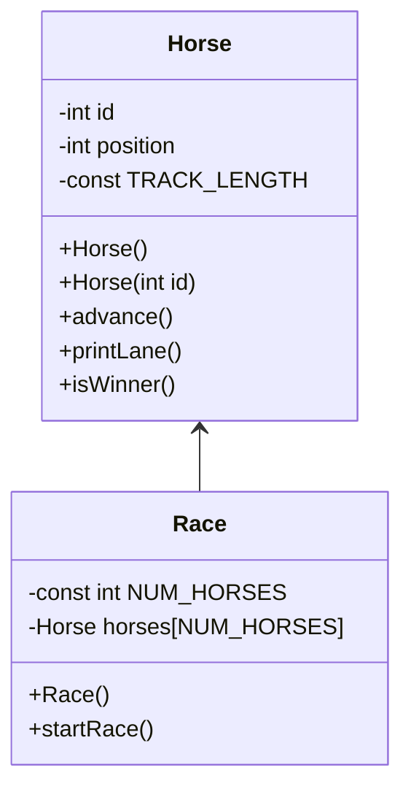

### UML


### Method Documentation

```
//horse.cpp
Horse(int id)
    set the Horse attribute id to the passed id
    initialize position to 0

advance()
    create an int coin and give it a random int 0-1
    if coin equals zero
        add one to position

printLane()
    for i in range TRACK_LENGTH, i increases by 1
		if i is equal to position
			print id
		else
			print "."

bool isWinner()
    if position is greater than TRACK_LENGTH
        return true
    else
        return false

//race.cpp
start()
    boolean keepGoing gets true
    while keepGoing is true
        for i in range NUM_HORSES, i increases by 1
            horses[i].advance
            if horses[i].isWinner is true
                print "Horse <i> wins"
                keepGoing gets false
            else
                horses[i].printLane

        print "press ENTER for another round"
